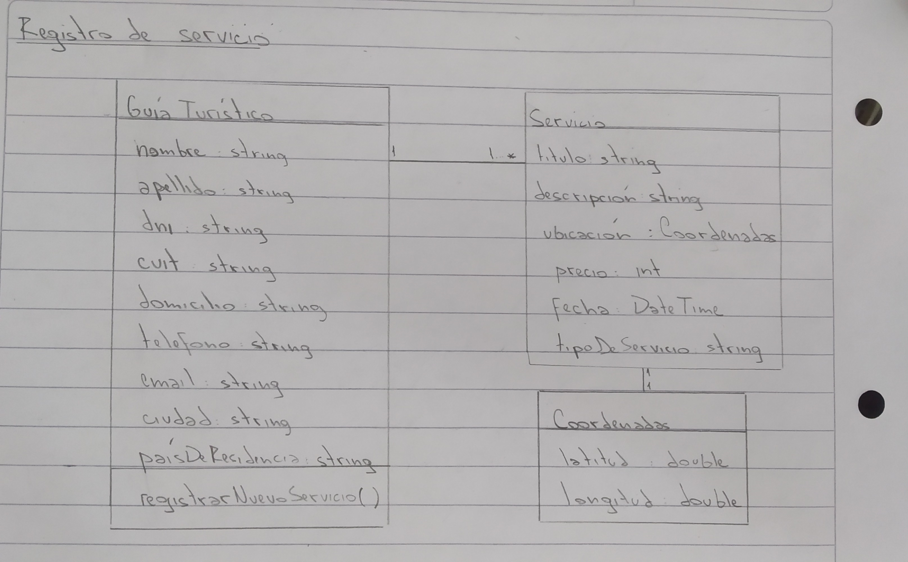

## Diagnóstico - Servicios Turísticos

### Requerimientos funcionales:

- El sistema debe permitir el registro de un nuevo usuario (Guía Turístico o Cliente).
- El sistema debe validar los datos ingresados por el usuario.
- El sistema debe permitir registrar una nueva oferta de servicio turístico al Guía Turístico.
- El sistema debe permitir consultar la oferta de servicios turísticos en su sitio web.
- El sistema debe permitir a los usuarios seleccionar uno o varios servicios disponibles para su reserva.
- El sistema debe calcular automáticamente el importe correspondiente a la seña (50%).
- El sistema debe permitir al cliente abonar el saldo del servicio en varios pagos.
- El sistema debe verificar la transacción (pago con tarjeta).
- El sistema debe enviar por email el voucher correspondiente al pago abonado.


### Requerimientos no funcionales:

- El sistema debe verificar que el CUIT ingresado por un Guía Turístico esté habilitado mediante el Web Service de AFIP.
- El sistema debe verificar la transacción con el gateway de la tarjeta de crédito.

### Diagrama de clases



### Diagrama de Secuencia

```
title Registrar servicio

Guía Turístico->IU:Ingresar al sitio web
IU->Controller:Validar logueo(Guía Turístico)
Controller->IU:Mostrar inicio de sesión
Guía Turístico->IU:registrarNuevoServicio()
IU->Controller:Validar datos
Controller->Persistencia:Almacenar datos
Controller->IU:Generar nueva oferta de servicio
```
